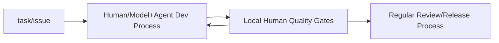
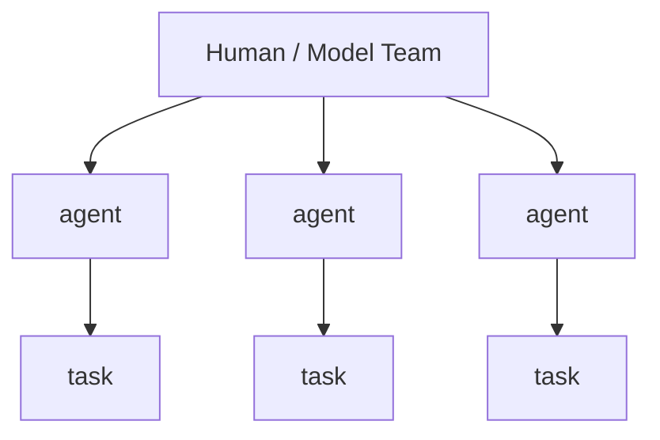

## Introduction

The past week has largely been spent in the trenches working on plumbing projects to try and implement some of the system I have in mind for continuing to work with code assist technologies, instead of having stupid fun times with the crazy crew at Desert Island Games. Hopefully this week we will be back to finishing off their initial implementation of **Alpha Prime (A')** , a re-imagining of Stuart Mark's wonderful **Omega** from the days of yore.

I continue to try and iterate on process and prompts to address issues and allow some measure of control in the process. The current idea in my head is something along the lines of:



Possibly at some point, the Dev Process step would completely be the model and agents working through a process, but that is still being ironed out. It will either be a TDD/Agile process, or a CMM level 3-ish style process. I don't think at this time it will be hands off though. I get the best results when I am involved—guiding, suggesting, and directing the model and agents in completion of their tasks.

The model that I've come to anchor these past couple of weeks on in my mind as I've tried to process everything is this has been something along the lines of a primitive hierarchical reasoning model, except with a human at the root of the tree, riding shotgun with a model as they direct agents to complete various tasks.




## Projects

So what have I been spending my time on? Well, this whole thing has uncorked something in my mind, so ideas flow, and the little team of software wizards makes it easy to rather quickly implement a prototype, if not the actual solution. So here is a rundown of the projects I've been working on these past weeks.


### Mnemosyne (+ private-journal-mcp mods)

Mnemosyne initially started out as an extension to the idea of **private-journal-mcp**. I'd read Jesse's post about his MCP server, so as soon as I started doing this, I knew I wanted to have that in place. I figure that getting that context and domain knowledge from having persistent memories about their interactions with you has to make this whole endeavor work better. Pretty much immediately after I started this journey, Anthropic released their agent support in Claude Code. So, the first thing I did was modify private-journal-mcp to add model and agent ids, so I could keep track of who was saying what. At the end of the first week, there were over 850 entries. Private-journal-mcp uses a file-based storage mechanism which is simple and useful in many ways, but we were just dipping our toes in, and they were already generating almost 1,000 entries a week. Claude figured within months, journal entries being separate files could become an issue.

So the next step was wiring up an sqlite3 backend, which was quick and easy too. That done, off we went, but I am curious and still exploring, so I ask if eventually the database is going to be a problem too. The models figure eventually utility will lessen due to something akin to information overload. So that was when mnemosyne was born. The idea is to stick a vector database into the system and get rich semantic search support. I suck at naming things, so after consultation with Claude, we soon have a new member on the team: **nomenclature-specialist**. First task: "Come up with a name for the project. Maybe use something from Greek Mythology." A reply is soon received, offering the name Mnemosyne and providing a bullet list of points supporting their argument. No arguments from me, dude—you are hired. There still is a conventional database—at the moment postgresql—which is the arrival point for journal entries and a long-term store of the original contents. From there a local model, **nomic**, generates the embeddings to be fed into a chroma db instance. On the other end sits another local model, **llama**, for text generation and distillation.

Then while walking our dog the other night I started thinking about the human notion of memory chunking, and whether that is possible for models, and the way vector databases operate. The models think there might be something there, but they pretty much always think there is something there.

The latest thing, though, is to generalize the idea and not have it directly tied to a certain use case like private-journal-mcp, but provide an interface for things like private-journal-mcp or Alexandria to use.

### Metis

This started out as an attempt to stick Sage Math into a MCP server. MCP servers give the model and agents a means to interact with and use tools to grant them powers they might not otherwise have. Models are notorious for their math abilities, though whoever is kicking ass on the International Math Olympiad problem sets is well beyond me. Well, why not give the model and agents a way to do math the way many humans do it? It frees them from burning tokens doing whatever they do to get a math answer and should hopefully give them the ability to do many things. Sage Math is a whole collection of math and science open source software. So if I get it set up and they use the tools, the agents will then have access to Sage Math, R, Maxima, Octave, and more. The reason for using an MCP server is that the Bash tool has a 2-minute timeout, and this bypasses that limitation. We get it set up and set the math and science geek agents from the two Desert Island Games projects to exercising the Sage Math capabilities. They supposedly run models and calculations for the game balance of **Alpha Prime** and the system models for the planetary physics simulation. Now when they are trying to determine a value for some calculation, instead of sitting there iterating, trying out different values, I have them run some model with sage to get their answer. They generate so much "paperwork" from my demands that they put everything in writing that it is impossible for to wade through it all, so for all I know they are just having fun generating fractals, and having sage return a number from the hwrng when asked for a value. Well the Sage Math idea seemed to work, and the ASCII frames feature in the simulation seems to help them in their debugging, so what else can I wire up for them to try? Chip EDA software? Could I wire up a whole pipeline of text/command line based IC design tools to MCP? Could they actually design something through the knowledge in their model, like a CPU? That is next on the Metis agenda to find out.

### Alexandria

While working on part of Mnemosyne, I asked Claude if it had any recommendations for books related to this process stuff we've been doing, and it dutifully listed of series of books. I'm sitting there going "Got that one...got that one...got that one." Probably owning half of the books listed, but few of them actually been fully read by my world-class tsundoku master ADHD brain. Then a thought rises up - Could I just take this thing I'm doing with Mnemosyne for the models memories, and dump my ebooks, and research papers into it? How do I do this without piping entire books through the remote model. The idea is basically the same though, data goes in to the vector database, and then semantic search is available. **nomic** once again on embedding duty, and I believe **mistral** was chosen for summarization. The idea I have right now for an actual reading case beyond the semantic search is either a separate interface where I am getting fed the material by a local model, or using whatever means I would normally use to read them. Then if I have questions, or want to bounce ideas off something, I can discuss it with the remote model. **nomenclature-specialist** doesn't get credit for the name though. This one was mine.

### ai-gatekeeper

Now I have multiple local models wanting to make use of an aging RTX 3070, how do I stop everyone from stampeding each other? There has to be a solution out there, but Claude just stares at me blankly when asked. So ai-gatekeeper is born to sit above ollama, or vLLM and coordinate jobs going to the GPU.

### reposentry

One of the more annoying parts of code assisted development, especially if you aren't pair programming with them, and watching like a hawk is that when they smash their context window, it seems like knowledge of the git repository state is one of the first things to go. Stopping them from committing is easy enough probably with hooks, but that wouldn't stop them from making changes, so now my problem is just worse. I want commits in the tradition of the linux kernel - one logical change. I don't care if it is going to take a lot of commits, just make it all logically sane, and bisect-able. So the idea behind reposentry is rooted in my earlier days of being paid to program, which was on a team doing Capabilities Maturity Model level 3 software engineering. A pain for most humans, but the model, and agents shouldn't have the issues with it that we do. I can make a code-reviewer agent review changes, and kick things back to the developer agent if the code-reviewer's quality gates aren't met. Could I make these things do CMM style development, complete with a Change Review Board? Could it spin up agents with dynamically generated prompts specifically purposed on domain knowledge of the change being reviewed? Reposentry is a piece of experimenting to find that out. Instead of actually working in the true git repository, the model, and agents will be working with a mirage, while the reposentry controls the true state of the repository, and controls the state transition through whichever process they are following. If it ends up working, then it should help me mitigate some of the issues in working with this technology.

### kernel-tools

This was the initial project we worked on, cleaning up some python scripts I use in my kernel subsystem maintenance work. They contain a lot of domain knowledge about how we work with upstream kernels, and our RHEL kernels, and are largely tools to help me avoid mistakes that have occurred before.

### paper-organize

While trying to find out more about how the prompt and attention mechanism works, I was eventually sent off to Arxiv to grab a paper. I'm sure the DOI identifiers that the pdf files have are great for something, but I have a folder of these, and I can never remember what the hell any of the files are. Another light bulb pops up, and 2 hours later this tool was ready for me to download research papers, give them a sane filename, and then stick them in a directory for me.


## Continued Adventures


Our shenanigans have continued over the week since we last posted. Some good experiences, and some not so good, but all a part of learning how this is going to go. We experimented with trying to handle more than one model instance at a time, but I think it is probably just asking for trouble if you do it while working on something serious. For myself, I think the best process I have so far is with me as the gatekeeper when they try to change file state. That way I can walk through the change, and push back right there if I don't like what they are doing. Not really as fast as the vibe end of the pool, but likely a lot less headaches overall in the end. They've done stupid things, and sometimes I've even accidentally helped them along in that. Mid-week while working on mnemosyne, Claude gave himself a lobotomy. Luckily we had backups, and then quickly instituted much more stringent backup policies, and which databases they are touching when. You can get so used to approving what they are doing, that your fingers are reacting before your mind truly registers that he wanted to drop the db, and was pointing at this main db. In the end it worked out, and we would've recovered in any case, but it highlights how easy it is for mishaps to happen, especially since you using natural language to program the model and agents.

We also spent a good part of an afternoon, cleaning up their tech debt in that project after the mishap. At some point they'd decided to do a commit with --no-verify, bypassing the type-checker, linter, and tests, and then kept doing it. Eventually ending up with a mass of type-check and linter errors to deal with. If you aren't going to use the type-checker, and linter why even bother having them was my question. Never really got much of a response, but I think private-journal and by extension mnemosyne are important to how this is working, so I wanted it all cleaned up. What followed was a multi-hour session, utilizing stgit to go all the way back to the first commit, and work our way forward cleaning it all up. I didn't make them do all of it, I took part as well, and eventually we got back to the finish line. Now they are off chasing another plan they have for mnemosyne. For that project we are trying a bit of twist on what we have done so far, and Claude is now management material. There even is a project-manager agent under him that worked with other agents to put together their plan, and write out which agents should be tasked to the various stories. Now they are off working their way through that. I've had to hop in and nudge Claude to let the agents do the things they were assigned to do, and so far it seems to be going okay:

<div class="terminal-output">
<span class="symbol-info"><b>Claude:</b></span><br>
   Current Status:<br>
  ✅ All required agents successfully deployed to .claude/agents/<br>
  ✅ Session handoff documentation updated<br>
  ✅ Foundation Phase work committed and ready for review<br>
<br>
  After restart, you'll have access to:<br>
<br>
  <ul>
    <li>database-specialist (for database architecture approval)</li>
    <li>senior-engineer (for implementation review)</li>
    <li>qa-engineer (for quality validation)</li>
    <li>Plus all the existing agents</li>
  </ul>
  Next Session Priorities:<br>
<br>
  <ol>
    <li>Get Foundation Phase specialist approvals using newly available agents</li>
    <li>Begin Core System Phase coordination per unified plugin architecture plan</li>
    <li>Proper agent delegation for remaining 10-sprint implementation</li>
  </ol>
  Perfect timing for a clean transition to the unified plan with full agent support! 🚀<br>
<br>
<span class="symbol-info"><b>Me:</b></span> try him now<br>
<br>
<span class="symbol-info"><b>Claude:</b></span><br>
<span class="symbol-record">⏺</span> database-specialist(Foundation Phase database work approval)<br>
<span class="symbol-branch">⎿</span> Done (22 tool uses · 79.1k tokens · 33m 46.6s)<br>
<br>
<span class="symbol-record">⏺</span> Excellent! The database-specialist is now working. Let me get the security and systems architecture approvals:<br>
<br>
<span class="symbol-record">⏺</span> security-engineer(Foundation Phase security architecture approval)<br>
<span class="symbol-branch">⎿</span>  Done (20 tool uses · 86.3k tokens · 10m 43.3s)<br>
<br>
<span class="symbol-record">⏺</span> systems-architect(Foundation Phase systems architecture approval)<br>
<span class="symbol-branch">⎿</span> Done (13 tool uses · 73.2k tokens · 2m 31.6s)<br>
<br>
<span class="symbol-record">⏺</span> Perfect! Now I have all three Foundation Phase approvals. Let me update the todo status and proceed to Core System Phase coordination:<br>
<span class="symbol-info">Update Todos</span><br>
<span class="symbol-branch">⎿</span><span class="symbol-completed">☒</span> Update session handoff documentation<br>
<span class="symbol-completed">☒</span> Deploy required agents for unified plan<br>
<span class="symbol-completed">☒</span> Get Foundation Phase specialist approvals<br>
<span class="symbol-pending">☐</span> Begin Core System Phase coordination<br>
<br>
<span class="symbol-info"><b>project-manager</b></span> (Coordinate Core System Phase transition)<br>
<span class="symbol-branch">⎿</span> time - get_current_time (MCP)(timezone: "America/Phoenix")<br>
</div><br>


### The joys of slash commands

Claude and I have been playing with these, and came to the conclusion that we can use them like natural language emacs macros. The result of which initially are: `/agent-browse`, `/agent-search`, and `/agent-deploy`. When `/agent-broswe` is invoked I will end up seeing something like this:


```
⏺ Agent Collection Overview (75 total agents):

  🎮 GAME DEVELOPMENT
  - cultural-mythology-engine.md
  - game-balance-analyst.md
  - game-design-reviewer.md
  - game-design-strategist.md
  - game-engine-architect.md
  - game-performance-analyst.md
  - game-subsystem-engineer.md
  - rendering-engineer.md
  - simulation-designer.md
  - simulation-engineer.md

  🏗️ SYSTEM ARCHITECTURE
  - armored-warfare-ai-architect.md
  - competitive-systems-designer.md
  - educational-systems-designer.md
  - game-engine-architect.md
  - gui-developer-tools-architect.md
  - language-architect.md
  - memory-architecture-specialist.md
  - policy-pack-architect.md
  - social-systems-designer.md
  - systems-architect.md
  - world-generation-architect.md

  🔬 SCIENTIFIC/MATHEMATICAL
  - climate-scientist.md
  - computational-hydrologist.md
  - mathematical-computing-specialist.md
  - mathematical-workflow-designer.md
  - scientific-documentation-specialist.md

  💾 DATA/DATABASE
  - ai-orchestration-specialist.md
  - data-architect.md
  - data-processing-specialist.md
  - database-specialist.md
  - html-css-agent.md (newly added!)
  - ml-embeddings-specialist.md
  - vector-researcher.md

  ⚙️ ENGINEERING/DEVOPS
  - ai-systems-engineer.md
  - cfd-specialist.md
  - compiler-pipeline-debugger.md
  - configuration-deployment-engineer.md
  - container-infrastructure-engineer.md
  - debug-specialist.md
  - devops-engineer.md
  - performance-engineer.md
  - python-cli-specialist.md
  - qa-engineer.md
  - rust-specialist.md
  - security-engineer.md
  - senior-engineer.md
  - test-specialist.md
  - vm-specialist.md

  📋 PROCESS/MANAGEMENT
  - alexandria-integration-specialist.md
  - compliance-auditor.md
  - integration-specialist.md
  - mnemosyne-integration-specialist.md
  - process-engineer.md
  - process-orchestration-specialist.md

  🔧 LANGUAGE/TOOLS
  - bytecode-optimizer.md
  - compiler-pipeline-debugger.md
  - dsl-designer.md
  - typescript-database-engineer.md

  📝 OTHER SPECIALISTS
  - code-reviewer.md
  - geophysicist.md
  - kernel-hacker.md
  - nomenclature-specialist.md
  - plan-validator.md
  - project-historian.md
  - project-librarian.md
  - project-manager.md
  - project-scope-guardian.md
  - strategy-guide-writer.md
  - technical-feasibility-assessor.md
  - theoretical-physicist.md
  - ux-design-expert.md

  💡 Use '/agent-deploy AGENT_NAME' to add to current project
```


I tend to save off agents we've used into a directory so I can look at them later, and now we use that to see if an agent exists already that we can modify, before creating a new one. Invoking `/agent-deploy` will then look for an agent, and deploy it into the project/.claude/agents directory. Then we can just quickly `/exit` and `claude --resume` , and our new agents will be waiting to go to work. 


